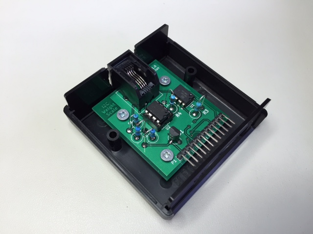
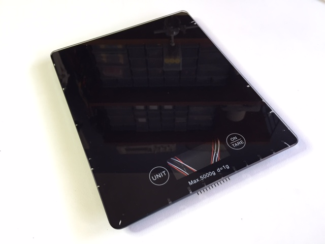

I²C Weight Scale
================

_I²C Weight Scale: strain gauges in a Wheatstone bridge amplified in an
instrumentation amplifier, A/D converted and made available over I²C in a PIC
microcontroller._

I²C slave. Reading from the slave responds with a stable digital representation
of the load on the strain gauges under a hacked ordinary weight scale.

Schematic
---------

The [KiCad](http://www.kicad-pcb.org/) source files can be found under `PCB/`.
The schematic rendered as a PDF is reached by clicking the PNG below.. The
KiCad project depends on [my component library](https://github.com/simlun/kicad-library-by-simlun)
which should be checked out alongside this repository.

Hacked Weight Scale
-------------------

Simply buy a cheap kitchen weight scale, remove its PCB and instead take the
4x3=12 leads from the 4 strain gauges to create an external port from a 2.54 mm
pin header.

The I²C Weight Scale PCB is a module that can connect to any weight scale of 4
strain gauges.

License
-------

This work is licensed under the Creative Commons Attribution-ShareAlike 4.0
International License. To view a copy of this license, visit
http://creativecommons.org/licenses/by-sa/4.0/ or send a letter to Creative
Commons, PO Box 1866, Mountain View, CA 94042, USA.
